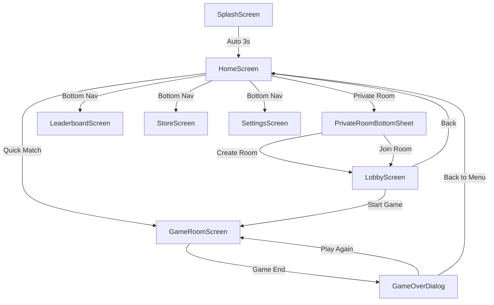
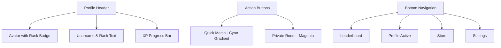
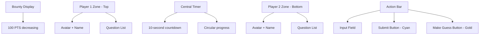
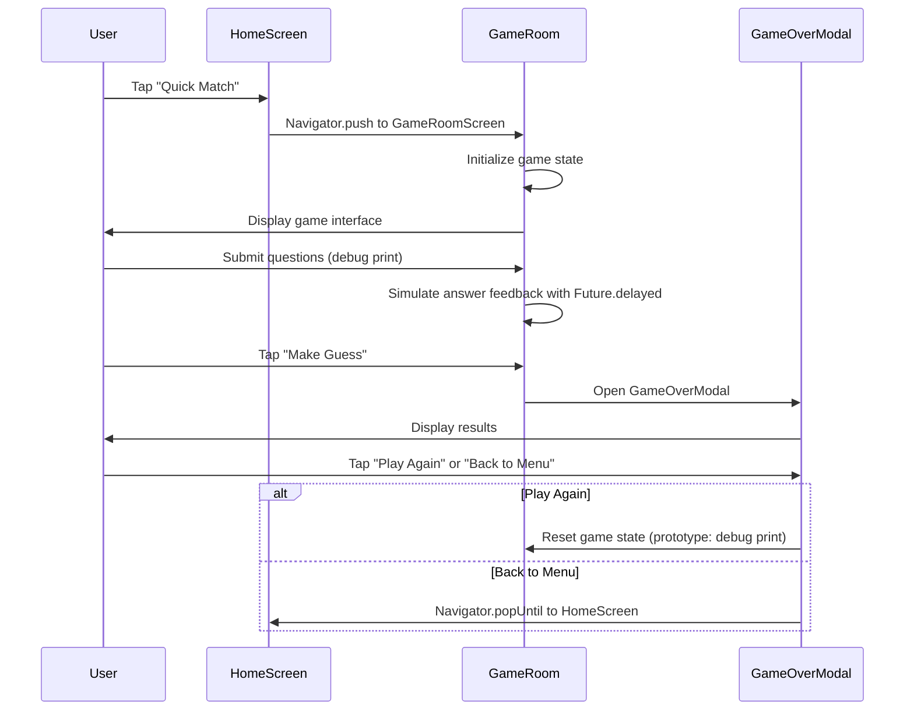
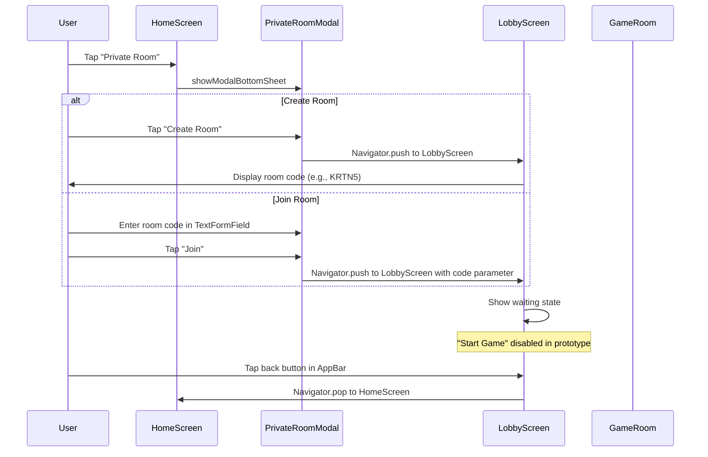
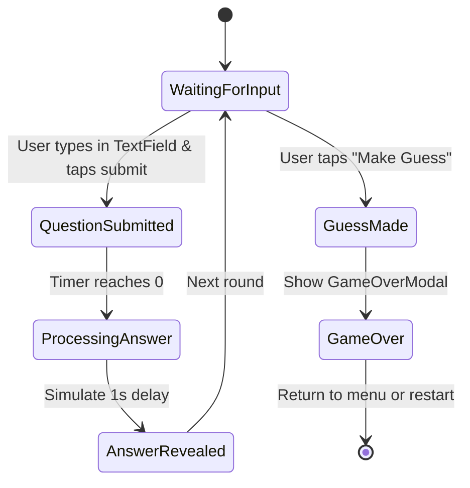

# Yes Or No Game - Frontend Design Document

## 1. Overview

### 1.1 Project Summary
"Yes Or No" is a mobile-first, real-time 1v1 deduction game where players compete to identify a secret word through strategic yes/no questions. The application is designed as a competitive cerebral battlefield with a futuristic, premium aesthetic combining glassmorphism, neon glows, and dynamic visual feedback.

### 1.2 Target Platform
- Primary: iOS and Android mobile applications
- Technology: Flutter framework with Dart language
- State Management: Provider, Riverpod, or Bloc pattern
- Navigation: Flutter Navigator 2.0
- Future Integration: Firebase (Authentication, Firestore, Cloud Functions)

### 1.3 Design Philosophy
- **Prototype Mode**: UI/UX fully functional for navigation; game logic returns debug prints only
- **Visual Style**: Futuristic glassmorphism with neon cyan, magenta, and gold accents
- **Cross-Platform**: Single codebase for iOS and Android with platform-specific adaptations
- **Widget Architecture**: Reusable, composable Flutter widgets following material design principles
- **Immutability**: State management following Flutter best practices

## 2. Design System

### 2.1 Color Palette

| Purpose | Color Code | Usage |
|---------|------------|-------|
| Primary Accent (Cyan) | #00FFFF | Primary actions, player indicators, timer |
| Secondary Accent (Magenta) | #FF00FF / #D946EF | Secondary actions, private room features |
| Tertiary Accent (Gold) | #FFD700 | "Make Final Guess" button, victory elements |
| YES Feedback | #00FF7F (SpringGreen) | Affirmative answers, positive feedback |
| NO Feedback | #FF4136 (Crimson) | Negative answers, critical states |
| Background Dark | #0A192F / #0D1B2A / #0D0B1A | Main background |
| Glassmorphism Panel | rgba(20, 20, 30, 0.7) | Semi-transparent overlays |
| Text Primary | #FFFFFF / #F5F5F5 | Headings and body text |
| Text Secondary | #9bbbbb / #EAEAEA | Subtitles and descriptions |

### 2.2 Typography

| Element | Font Family | Weight | Size | Color |
|---------|-------------|--------|------|-------|
| Body | Poppins / Space Grotesk | 400 | 16px | #F5F5F5 |
| Headings | Poppins / Space Grotesk | 600-700 | 22-48px | #FFFFFF |
| Digital Timer | Orbitron | 700 | 32-48px | #00FFFF |
| Buttons | Poppins / Space Grotesk | 700 | 16-20px | Context-dependent |

**Font Import**: Google Fonts package for Flutter (Poppins, Space Grotesk, Orbitron)

### 2.3 Visual Effects

| Effect | Specification | Application |
|--------|---------------|-------------|
| Glassmorphism | background: rgba(20,20,30,0.7); backdrop-filter: blur(15px); border: 1px solid rgba(255,255,255,0.1) | Modal panels, cards, overlays |
| Cyan Glow | box-shadow: 0 0 25px #00FFFF | Primary buttons, player 1 indicators |
| Magenta Glow | box-shadow: 0 0 15px #FF00FF | Secondary buttons, private room elements |
| Gold Glow | box-shadow: 0 0 20px #FFD700 | Guess button, victory screen |
| Border Radius | 16px (panels), 12px (buttons) | Rounded corners throughout |
| Animations | Glow pulse, fade-in-scale, digital rain | Interactive feedback and ambiance |

### 2.4 Background Treatment
- Blurred gradient from warm amber (#FFB74D) to cerulean blue (#4FC3F7) OR
- Dark gradient with floating particle effects for depth
- Semi-transparent overlays to create depth hierarchy

## 3. Application Architecture

### 3.1 Navigation Structure

### 3.2 Component Hierarchy

| Level | Widget | Children |
|-------|--------|----------|
| Root | MyApp | MaterialApp, Theme |
| Navigation | Navigator | All screen widgets |
| Screen | HomeScreen | ProfileHeader, XPProgressBar, ActionButtons, BottomNavBar |
| Screen | GameRoomScreen | PlayerZone, CountdownTimer, BountyDisplay, ActionBar |
| Screen | LobbyScreen | RoomCodeDisplay, PlayerSlots, ActionButtons |
| BottomSheet | PrivateRoomBottomSheet | TextFormField, ActionButtons |
| Dialog | GameOverDialog | ResultDisplay, SecretWordReveal, ActionButtons |

### 3.3 State Management Strategy

| State Type | Management Approach | Example Data |
|------------|---------------------|--------------|
| Navigation | Flutter Navigator | Current route, route stack |
| UI State | StatefulWidget or Provider | BottomSheet visibility, input values |
| Game State | Provider/Riverpod/Bloc | Player questions, timer, bounty |
| User Profile | Provider/Riverpod | Username, avatar, rank, XP |
| Remote Data | Future Firebase integration | User auth, game sessions, leaderboard |

## 4. Screen Specifications

### 4.1 SplashScreen

**Purpose**: Initial loading and branding

**Visual Elements**:
- Centered Y/N logo with neon gradient (cyan to magenta)
- Glowing effect with SVG filters
- Dark gradient background
- Optional: "Quick Play" button with pulsing animation

**Behavior**:
- Display logo for 3 seconds using Timer or Future.delayed
- Auto-navigate to HomeScreen using Navigator.pushReplacement
- No user interaction required (unless Quick Play button present)

**Design Reference**: Uses Space Grotesk font, gradient from cyan (#00e5ff) to fuchsia (#ff00ff) with glow filter

**Flutter Implementation Notes**:
- Use CustomPaint or ShaderMask for gradient effects
- SVG logo rendered with flutter_svg package
- Glow effects achieved with BoxShadow and BackdropFilter

---

### 4.2 HomeScreen

**Purpose**: Main menu and user profile dashboard

**Layout Structure**:

**Visual Components**:

| Component | Description | Styling |
|-----------|-------------|---------|
| Profile Header | Avatar (128px circle), username, rank text | Border: 2px primary (#0df2f2), Badge: military_tech icon |
| XP Bar | Progress indicator | Background: gray-800, Fill: gradient cyan with glow |
| Quick Match Button | Primary CTA | Gradient: #14FFEC to #0D9488, shadow-glow-teal, height: 132px+ |
| Private Room Button | Secondary CTA | Solid #D946EF, shadow-glow-magenta, height: 132px+ |
| Bottom Nav | Icon navigation | Sticky bottom, glassmorphism backdrop |

**Interactions**:
- Quick Match → Navigator.push to GameRoomScreen
- Private Room → showModalBottomSheet for PrivateRoomBottomSheet
- Bottom Nav → Update selected index and display corresponding screen
- Icons use Material Icons or custom SVG assets

---

### 4.3 PrivateRoomModal

**Purpose**: Create or join private game sessions

**Layout**: Bottom sheet with glassmorphism effect (using BackdropFilter)

**Visual Elements**:

| Element | Specification |
|---------|---------------|
| Container | Max-width: 480px, Background: rgba(26,26,26,0.8), Rounded: xl |
| Title | "Private Room", Size: 3xl, Bold, White |
| Subtitle | Gray text explaining functionality |
| Create Button | Full-width, Cyan (#06f9f9), Glow-pulse animation |
| Divider | Horizontal line with "OR" text overlay |
| Input Field | Placeholder: "Enter Room Code", Focus ring: Magenta (#FF00FF) |
| Join Button | Full-width, Magenta (#FF00FF) |
| Close Icon | Top-right corner, Material Symbols "close" |

**Interactions**:
- Create Room → Navigator.push to LobbyScreen
- Join (with code validation) → Navigator.push to LobbyScreen
- Close → Navigator.pop to dismiss bottom sheet

**Flutter Implementation**:
- Use showModalBottomSheet with isDismissible: true
- TextFormField with validators for room code
- ClipRRect with BackdropFilter for glassmorphism

**Background**: Dark with blur effect

---

### 4.4 LobbyScreen

**Purpose**: Waiting room for private matches

**Layout Structure**:
- Header: Back button, "Private Lobby" title, Settings icon
- Center: Large glowing room code (e.g., "KRTN5")
- Player slots (2): One filled with avatar, one "Waiting for opponent..."
- Footer: "Start Game" button (disabled in prototype)

**Visual Elements**:

| Component | Description | Styling |
|-----------|-------------|---------|
| Room Code | Large display | Color: primary (#13a4ec), Animation: glow (cyan pulsing) |
| Copy/Share Button | Icon + text | Background: primary/20, Text: primary |
| Player Slot (Filled) | Avatar + username | Ring-2 ring-primary, 80px circle |
| Player Slot (Empty) | Dashed border circle | Opacity: 50%, Pulse animation, "person_add" icon |
| Start Button | Disabled state | Background: gray-700, Text: gray-500, Cursor: not-allowed |

**Interactions**:
- Back → Navigator.pop to return to HomeScreen
- Copy/Share → Use Clipboard.setData and Share.share
- Start Game → Disabled in prototype

**Flutter Implementation**:
- Use AppBar with leading back button
- Material Icons for share and settings
- Positioned or Stack for layout control

---

### 4.5 GameRoom

**Purpose**: Main gameplay interface

**Layout**: Vertical split with central timer

**Visual Specifications**:

| Section | Description | Styling |
|---------|-------------|---------|
| Bounty Bar | Top sticky bar | Glassmorphism, Text: "BOUNTY: 100 PTS", Font: Orbitron |
| Player Zone | Question history | Border distinguishes active player (cyan) vs opponent (gray/orange) |
| Question Card | Individual Q&A | Glassmorphism, Border changes: Neutral → Green (YES) / Red (NO) |
| Timer | Circular SVG countdown | Stroke: cyan (>5s), yellow (3-5s), red (<3s); Glow intensifies |
| Input Field | Text entry | Background: indigo/50, Border: cyan/30, Placeholder: gray-400 |
| Submit Button | Send question | Background: cyan/90, Shadow: glow-cyan |
| Guess Button | Final answer | Background: gold (#FFD700), Shadow: glow-gold, Full-width |

**Answer Color Feedback**:
- YES: Border `#00FF7F`, Shadow `glow-emerald`
- NO: Border `#FF4136`, Shadow `glow-crimson`

**Timer Behavior**:
- Start at 10 seconds
- SVG stroke-dashoffset animates progress
- Color transitions: Cyan → Yellow (≤5s) → Red (≤3s)
- Glow intensity increases as time decreases

**Prototype Interactions**:
- Submit → Add hardcoded question to player list, randomly color green/red after 1s delay using Future.delayed
- Make Guess → Debug print "Final Guess Submitted"

**Flutter Implementation**:
- Use ListView.builder for question lists
- AnimatedContainer for color transitions
- CustomPaint for circular timer with animation
- GestureDetector or ElevatedButton for interactions
- Stack widget for split-screen layout

**Ambient Effects**:
- Floating particles in background (drift animation)
- Glassmorphism overlays on all UI elements

---

### 4.6 GameOverModal

**Purpose**: Display match results

**Layout**: Centered modal overlay

**Visual Elements**:

| Element | Specification |
|---------|---------------|
| Container | Background: #1C1C2E, Border: subtle white/10, Rounded: 2xl, Max-width: 480px |
| Result Text | "YOU WIN!" / "YOU LOSE!", Size: 5xl, Color: Gold (#FFD700), Text-shadow: gold glow |
| Secret Word Label | "The secret word was:", Gray-400, Small |
| Secret Word | Large (3xl), Bold, Letter-spacing: 0.2em, White |
| Points Display | "+25 Points" (or loss), Color: SpringGreen or Crimson |
| Progress Bar | XP gain visualization | Gradient green, Animated fill |
| Play Again Button | Primary action | Cyan, Glow-cyan shadow, Full-width |
| Back to Menu Button | Secondary action | Transparent, Border: white/30, Full-width |

**Interactions**:
- Play Again → Debug print, Navigator.pop to close dialog
- Back to Menu → Navigator.popUntil to return to HomeScreen

**Background**: Blurred game room with dark overlay using BackdropFilter

**Flutter Implementation**:
- Use showDialog with barrierDismissible: false
- Stack with BackdropFilter for blur effect
- AnimatedOpacity for fade-in effect

## 5. Component Design Patterns

### 5.1 Reusable Widgets

**CustomButton Widget**:
- Parameters: variant (primary/secondary/tertiary), onPressed, child, isEnabled
- Variants map to color schemes: cyan, magenta, gold
- Includes InkWell ripple effects and glow BoxShadow
- Uses ElevatedButton or custom Container with GestureDetector

**AvatarWidget**:
- Parameters: imageUrl, size, borderColor, badge
- Sizes: small (48.0), medium (80.0), large (128.0)
- Optional rank badge overlay using Stack and Positioned
- CircleAvatar with NetworkImage or AssetImage

**ProgressBarWidget**:
- Parameters: current, max, color, glowIntensity
- Animated fill using AnimatedContainer or TweenAnimationBuilder
- Displays numerical value with Text widget

**QuestionCardWidget**:
- Parameters: text, status (neutral/yes/no)
- Dynamic border and shadow based on status using BoxDecoration
- Glassmorphism achieved with ClipRRect and BackdropFilter

**CustomDialog/BottomSheet Wrappers**:
- Parameters: child, onClose, isDismissible
- Backdrop: Container with Colors.black.withOpacity(0.6) and BackdropFilter
- Animation: Built-in Material dialog/bottom sheet animations
- Close IconButton in top-right corner

### 5.2 Theme Configuration

**ThemeData** should include:
- Custom MaterialApp theme
- Font configuration via google_fonts package (Poppins, Space Grotesk, Orbitron)
- Color scheme definition (ColorScheme.dark with custom colors)
- TextTheme for consistent typography
- Custom ButtonTheme and ElevatedButtonThemeData
- Default BoxDecoration styles for glassmorphism

**Animation Definitions** (Using Flutter AnimationController):

| Animation | Implementation | Usage |
|-----------|----------------|-------|
| glow-pulse | TweenAnimationBuilder for BoxShadow blur radius | Buttons, timer |
| fade-in-scale-up | ScaleTransition + FadeTransition | Dialogs, bottom sheets |
| drift | AnimatedPositioned with Transform.rotate | Background particles |
| glitch | Transform matrix with periodic skew | Digital timer effects |
| tick-down | SlideTransition with opacity | Bounty counter |

## 6. Data Models

### 6.1 User Profile

| Field | Type | Description |
|-------|------|-------------|
| userId | String | Unique identifier |
| username | String | Display name |
| avatar | String (URL) | Profile image |
| rank | String | Rank tier (e.g., "Bronze Rank", "Processor") |
| rankIcon | String | Icon identifier |
| xp | Number | Current experience points |
| xpMax | Number | XP required for next level |

### 6.2 Game Session

| Field | Type | Description |
|-------|------|-------------|
| sessionId | String | Unique game identifier |
| roomCode | String (optional) | Private room code (5 chars) |
| player1 | UserProfile | First player data |
| player2 | UserProfile | Second player data |
| secretWord | String | Word to be guessed |
| bounty | Number | Starting at 100, decreases each round |
| currentRound | Number | Round counter |
| timer | Number | Countdown (0-10 seconds) |
| gameStatus | Enum | 'waiting', 'active', 'finished' |

### 6.3 Question Object

| Field | Type | Description |
|-------|------|-------------|
| questionId | String | Unique identifier |
| playerId | String | Who asked |
| text | String | Question content |
| answer | Enum | 'YES', 'NO', or null (pending) |
| roundNumber | Number | When it was asked |

### 6.4 Match Result

| Field | Type | Description |
|-------|------|-------------|
| winnerId | String | Victor's user ID |
| loserId | String | Defeated player's user ID |
| secretWord | String | The answer |
| finalBounty | Number | Points awarded |
| totalRounds | Number | How many rounds played |
| winCondition | Enum | 'correct_guess', 'opponent_quit', 'timeout' |

## 7. Navigation Configuration

### 7.1 Route Definitions

| Route Name | Screen Widget | Access | Transition |
|------------|---------------|--------|------------|
| `/` or `/splash` | SplashScreen | Public | Auto-navigate after 3s |
| `/home` | HomeScreen | Public | Default landing |
| `/game` | GameRoomScreen | Public | From Quick Match or lobby |
| `/lobby` | LobbyScreen | Public | From private room |
| `/leaderboard` | LeaderboardScreen | Public | Bottom nav |
| `/store` | StoreScreen | Public | Bottom nav |
| `/settings` | SettingsScreen | Public | Bottom nav |

### 7.2 Overlay Navigation
Overlays presented without route changes:
- `PrivateRoomBottomSheet`: showModalBottomSheet from HomeScreen
- `GameOverDialog`: showDialog from GameRoomScreen

### 7.3 Navigator Implementation
- Use named routes with onGenerateRoute for custom transitions
- MaterialPageRoute for standard transitions
- Optional: PageRouteBuilder for custom animations

## 8. User Flows

### 8.1 Quick Match Flow

### 8.2 Private Room Flow

### 8.3 Gameplay Interaction Flow

## 9. Responsive Design Strategy

### 9.1 Flutter Responsive Approach
Flutter automatically handles different screen sizes and pixel densities

### 9.2 Device Support

| Device Category | Screen Adjustments |
|-----------------|-------------------|
| Small phones (< 375 logical px) | Reduce padding with MediaQuery, smaller font sizes |
| Standard phones (375-428 logical px) | Default mobile experience |
| Large phones/Small tablets (> 428 logical px) | Optional: Slightly increased spacing |
| iOS | Safe area handling with SafeArea widget |
| Android | System UI padding with MediaQuery.padding |

### 9.3 Touch Targets
All interactive elements minimum 48.0 logical pixels (Material Design guidelines)

### 9.4 Typography Scaling
- Body: 14.0-16.0 logical pixels
- Headings: 20.0-48.0 logical pixels (use MediaQuery.textScaleFactor for accessibility)
- Buttons: 16.0-20.0 logical pixels

### 9.5 Platform Adaptations
- iOS: Cupertino-style navigation when appropriate
- Android: Material Design ripple effects
- Platform-specific fonts via ThemeData.platform

## 10. Accessibility Considerations

### 10.1 Color Contrast
- All text meets WCAG AA standards against backgrounds
- YES/NO feedback uses both color AND border thickness
- Critical states (timer warnings) use multiple indicators (color + animation)

### 10.2 Focus Management
- Use FocusNode for TextField management
- FocusScope to trap focus within dialogs
- Hardware keyboard support on tablets

### 10.3 Screen Reader Support
- Semantics widget for VoiceOver (iOS) and TalkBack (Android)
- ExcludeSemantics for decorative elements
- Announcements for timer and answer updates using SemanticsService.announce

### 10.4 Motion Sensitivity
- Glow/pulse animations are subtle
- Provide option to reduce motion (future enhancement)

## 11. Performance Optimization

### 11.1 Build Optimization
- Use `flutter build apk --release` and `flutter build ios --release`
- Enable code obfuscation for production
- Tree-shaking removes unused code automatically

### 11.2 Asset Optimization
- Use PNG for images with alpha, JPEG for photos
- Multiple resolutions in assets (1.5x, 2.0x, 3.0x)
- flutter_svg for vector graphics
- CachedNetworkImage for avatar loading with placeholders

### 11.3 Animation Performance
- Use Transform and Opacity for animations (GPU compositing)
- RepaintBoundary for expensive widgets
- Avoid rebuilding entire widget tree with const constructors
- TickerProviderStateMixin for animation controllers

### 11.4 Widget Efficiency
- Use const constructors wherever possible
- ListView.builder for long scrollable lists
- Avoid unnecessary setState calls
- Provider/Riverpod select for granular rebuilds
- DevTools for performance profiling

## 12. Testing Strategy

### 12.1 Widget Testing

**Unit Tests** (flutter_test package):

| Widget | Test Cases |
|--------|------------|
| CustomButton | Renders correctly, onPressed callback fires, variant styles, disabled state |
| AvatarWidget | Image loads, badge displays, size variants |
| ProgressBarWidget | Correct percentage calculation, color variants, animation |
| QuestionCardWidget | Status colors apply, text renders, decoration |
| Dialog/BottomSheet | Opens/closes, barrier dismissible, focus behavior |

### 12.2 Integration Testing

**Navigation Tests** (integration_test package):
- SplashScreen auto-navigates after 3 seconds
- HomeScreen button taps navigate correctly
- PrivateRoomBottomSheet actions navigate to lobby
- GameOverDialog actions navigate appropriately

**State Tests**:
- User profile persists across navigation
- Game state updates correctly (prototype debug prints)
- Provider/state updates reflect in UI

### 12.3 Golden Tests

**Flutter Golden Tests**:
- Generate golden images for all widget variants
- Compare renders across changes
- Test different screen sizes and pixel densities
- Interaction states (pressed, disabled)

### 12.4 Accessibility Testing

**Automated Tools**:
- Flutter's built-in semantics debugger
- Accessibility scanner in Flutter DevTools

**Manual Tests**:
- VoiceOver (iOS) and TalkBack (Android) compatibility
- Large text scaling (accessibility settings)
- Color contrast verification with Material Design guidelines

### 12.5 Platform Testing

**Target Platforms**:
- iOS 12.0+ (iPhone 6s and later)
- Android 5.0+ (API level 21+)

**Focus Areas**:
- BackdropFilter performance on both platforms
- Animation smoothness (60fps target)
- Touch gesture handling
- Safe area on notched devices
- Platform-specific UI differences

## 13. Implementation Phases

### Phase 1: Foundation
- Flutter project already initialized
- Add dependencies (google_fonts, flutter_svg, cached_network_image)
- Configure ThemeData with design tokens
- Implement base reusable widgets (CustomButton, AvatarWidget, CustomDialog)

### Phase 2: Static Screens
- SplashScreen with Timer-based navigation
- HomeScreen layout with Column/Stack
- PrivateRoomBottomSheet structure
- LobbyScreen layout

### Phase 3: Game Interface
- GameRoomScreen split-screen with Column/Expanded
- Timer widget with CustomPaint animation
- Question list with ListView.builder
- ActionBar with TextField and ElevatedButtons

### Phase 4: Navigation & State
- Flutter Navigator configuration with named routes
- Provider/Riverpod setup for state management
- Prototype interactions (debug prints)
- GameOverDialog with results display

### Phase 5: Polish & Testing
- Animation refinement with AnimationController
- Responsive adjustments using MediaQuery
- Accessibility audit (Semantics)
- iOS and Android device testing
- Documentation (README)

### Phase 6: Firebase Integration (Future)
- Add firebase_core, firebase_auth packages
- Implement authentication flow
- Set up Firestore for game data
- Cloud Functions for game logic

## 14. Technical Constraints & Dependencies

### 14.1 Required Packages (pubspec.yaml)

| Package | Version | Purpose |
|---------|---------|---------|
| flutter | SDK | Core framework |
| google_fonts | latest | Font loading |
| flutter_svg | latest | SVG rendering |
| cached_network_image | latest | Image caching |
| provider or riverpod | latest | State management |

### 14.2 Future Dependencies (Firebase)

| Package | Purpose |
|---------|---------|
| firebase_core | Firebase initialization |
| firebase_auth | User authentication |
| cloud_firestore | Real-time database |
| firebase_storage | Avatar/asset storage |

### 14.3 Development Tools

| Tool | Purpose |
|------|---------|
| Flutter DevTools | Debugging and profiling |
| Dart Analyzer | Static analysis |
| flutter_test | Unit/widget testing |
| integration_test | Integration testing |

### 14.4 Platform Requirements

**iOS**:
- Xcode 13.0 or later
- iOS 12.0+ deployment target
- CocoaPods for dependency management

**Android**:
- Android Studio or IntelliJ
- minSdkVersion: 21 (Android 5.0)
- targetSdkVersion: 33+ (Android 13+)
- Gradle for build management

## 15. Future Enhancements (Beyond Prototype)

### 15.1 Real-Time Functionality
- Firebase Cloud Messaging for real-time updates
- Firestore real-time listeners for live multiplayer
- Cloud Functions for server-side game state validation
- AI referee using ML Kit or cloud-based NLP

### 15.2 Progression System
- XP earning and leveling
- Rank advancement logic
- Achievement system

### 15.3 Social Features
- Friends list
- Match history
- Leaderboard rankings

### 15.4 Monetization
- In-app store for cosmetics
- Premium rank badges
- Avatar customization

### 15.5 Accessibility
- Settings panel for reduced motion
- Font size adjustments
- High contrast mode

### 15.6 Analytics
- User behavior tracking
- Match statistics
- Performance monitoring
