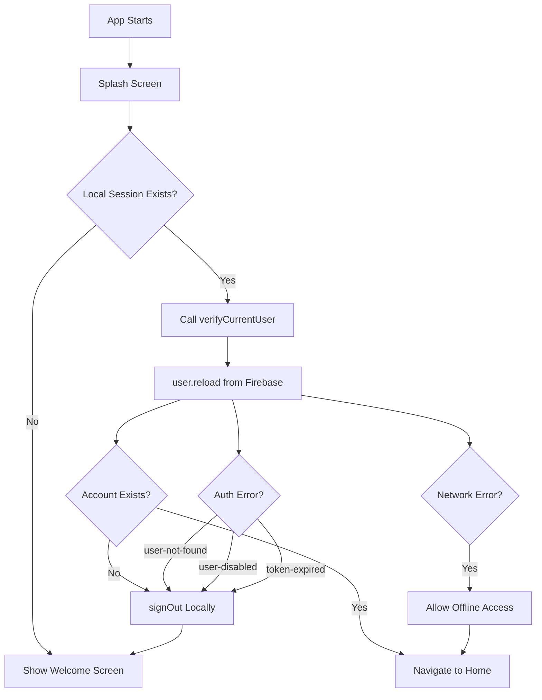

# Authentication Security Guide

## 🔒 Security Implementation Overview

This document explains how the authentication system protects user sessions and ensures security.

---

## Local Storage vs Firebase Verification

### How Firebase Auth Works

Firebase Authentication stores session information **locally on the device** in these locations:

| Platform | Storage Location |
|----------|-----------------|
| **iOS** | Keychain (encrypted) |
| **Android** | SharedPreferences (encrypted) |
| **Web** | IndexedDB / LocalStorage |

**Security Consideration:** While this data is encrypted by the OS, it only proves that a user **was** authenticated at some point. It doesn't guarantee the account still exists on Firebase.

---

## Security Vulnerabilities We've Addressed

### ❌ **Problem 1: Deleted User Can Still Access App**

**Scenario:**
1. User signs in anonymously → Local session stored
2. Admin deletes user from Firebase Console
3. User reopens app → Old local session still valid
4. **VULNERABILITY:** User can access app with deleted account

### ✅ **Solution: Session Verification on Startup**

We implemented `verifyCurrentUser()` in [`AuthService`](file:///Users/semihasdan/Documents/software/yes_or_no/lib/services/auth_service.dart):

```dart
Future<bool> verifyCurrentUser() async {
  final user = _firebaseAuth.currentUser;
  
  if (user == null) {
    return false; // No local session
  }
  
  try {
    // CRITICAL: Reload user data from Firebase
    await user.reload();
    
    // Check if account still exists
    final refreshedUser = _firebaseAuth.currentUser;
    if (refreshedUser == null) {
      // Account was deleted - clean up local session
      await _firebaseAuth.signOut();
      return false;
    }
    
    return true; // User verified
    
  } on FirebaseAuthException catch (e) {
    if (e.code == 'user-not-found' || 
        e.code == 'user-disabled' ||
        e.code == 'user-token-expired') {
      // Account invalid - sign out locally
      await _firebaseAuth.signOut();
      return false;
    }
    // Handle other cases...
  }
}
```

**What This Does:**
1. ✅ Checks local auth state
2. ✅ **Verifies with Firebase backend** that account still exists
3. ✅ **Automatically cleans up** invalid local sessions
4. ✅ Handles network errors gracefully

---

## Security Flow Diagram



---

## Implemented in Splash Screen

The [`SplashScreen`](file:///Users/semihasdan/Documents/software/yes_or_no/lib/screens/splash_screen.dart) now performs this check on every app launch:

```dart
Future<void> _checkAuthStatus() async {
  final authService = serviceLocator.authService;
  
  // SECURITY: Verify session with Firebase
  final bool isUserValid = await authService.verifyCurrentUser();

  if (isUserValid) {
    // Verified - allow access
    Navigator.of(context).pushReplacementNamed(AppRoutes.home);
  } else {
    // Invalid or deleted - require login
    Navigator.of(context).pushReplacementNamed(AppRoutes.welcome);
  }
}
```

---

## Error Handling Matrix

| Error Code | Meaning | Action Taken |
|------------|---------|--------------|
| `user-not-found` | Account deleted from Firebase | ✅ Sign out locally, show Welcome |
| `user-disabled` | Account disabled by admin | ✅ Sign out locally, show Welcome |
| `user-token-expired` | Session expired | ✅ Sign out locally, show Welcome |
| `network-request-failed` | No internet connection | ⚠️ Allow offline access |
| Other errors | Unknown issue | ✅ Sign out for safety |

---

## Offline Support

**Important:** If there's a network error during verification, we allow the user to continue:

```dart
case 'network-request-failed':
  debugPrint('Network error, allowing offline access');
  return true; // User can still use app offline
```

**Why?** 
- Mobile apps need to work offline
- User might be in airplane mode or poor network
- Firestore has offline caching enabled
- Better UX than blocking access on network issues

---

## Additional Security Measures

### 1. **Token Expiration**
Firebase automatically refreshes auth tokens. If a token expires and can't be refreshed:
- `user.reload()` will throw `user-token-expired`
- We automatically sign out the user

### 2. **Secure Storage**
Firebase uses platform-specific secure storage:
- **iOS:** Keychain (AES-256 encryption)
- **Android:** EncryptedSharedPreferences
- **Web:** Cookies with HttpOnly and Secure flags

### 3. **No Sensitive Data in Local Storage**
We never store:
- ❌ Passwords (anonymous auth has none)
- ❌ Payment information
- ❌ Personal identifiable information

Only the Firebase auth token is stored, which:
- ✅ Expires automatically
- ✅ Is encrypted by OS
- ✅ Is verified on each app launch

---

## Best Practices We Follow

### ✅ **1. Verify on App Launch**
Every time the app starts, we verify the session with Firebase backend.

### ✅ **2. Clean Up Invalid Sessions**
If verification fails, we immediately call `signOut()` to clear local data.

### ✅ **3. Handle All Error Cases**
We explicitly handle:
- User not found
- User disabled
- Token expired
- Network errors
- Unexpected errors

### ✅ **4. Fail Safely**
On unknown errors, we sign out rather than risk security.

### ✅ **5. Log Security Events**
All verification steps are logged for debugging:
```dart
debugPrint('verifyCurrentUser: User account is invalid, cleaning up session');
```

---

## What Happens When User is Deleted

### Scenario: Admin Deletes User from Firebase Console

**Timeline:**

1. **T+0s:** User account deleted in Firebase Console
2. **T+5s:** User reopens app on their phone
3. **Splash Screen runs:**
   ```
   flutter: verifyCurrentUser: Verifying user session for UID: abc123
   flutter: verifyCurrentUser: Firebase auth error - user-not-found
   flutter: verifyCurrentUser: User account is invalid, cleaning up session
   flutter: Splash: No valid user, navigating to Welcome
   ```
4. **Result:** User sees Welcome Screen, must create new account

**No security vulnerability** - the deleted user cannot access the app.

---

## Testing Security

### Test Case 1: Delete User While App is Closed
```bash
# 1. Sign in to app
# 2. Close app
# 3. Delete user from Firebase Console
# 4. Reopen app
# Expected: Welcome Screen (not Home Screen)
```

### Test Case 2: Disable User While App is Closed
```bash
# 1. Sign in to app
# 2. Close app  
# 3. Disable user in Firebase Console
# 4. Reopen app
# Expected: Welcome Screen (not Home Screen)
```

### Test Case 3: Network Offline
```bash
# 1. Sign in to app
# 2. Close app
# 3. Enable airplane mode
# 4. Reopen app
# Expected: Home Screen (offline access allowed)
```

### Test Case 4: Token Expiration
```bash
# 1. Sign in to app
# 2. Wait for token to expire (typically 1 hour)
# 3. Reopen app
# Expected: Firebase auto-refreshes token OR shows Welcome Screen
```

---

## Firestore Security Rules

Our Firestore rules prevent unauthorized access even if someone bypasses client-side checks:

```javascript
rules_version = '2';
service cloud.firestore {
  match /databases/{database}/documents {
    match /users/{userId} {
      // SECURITY: Only authenticated users can access their own data
      allow read, write: if request.auth != null 
                          && request.auth.uid == userId;
    }
  }
}
```

**This means:**
- ✅ User must be authenticated (have valid Firebase token)
- ✅ User can only access their own document (UID must match)
- ✅ Deleted users cannot access ANY data (no valid token)

---

## Comparison: Before vs After

### ❌ **Before (Insecure)**
```dart
// Old code - just checked local storage
bool isUserSignedIn() {
  return _firebaseAuth.currentUser != null;
}

// VULNERABILITY: Doesn't verify account still exists on Firebase
```

### ✅ **After (Secure)**
```dart
// New code - verifies with Firebase backend
Future<bool> verifyCurrentUser() async {
  final user = _firebaseAuth.currentUser;
  if (user == null) return false;
  
  try {
    await user.reload(); // VERIFY WITH FIREBASE
    return _firebaseAuth.currentUser != null;
  } catch (e) {
    await _firebaseAuth.signOut(); // CLEAN UP
    return false;
  }
}
```

---

## Common Questions

### Q: Why not just check `currentUser != null`?
**A:** That only checks **local** storage. The account might be deleted on Firebase but still cached locally.

### Q: What if the user is offline?
**A:** We allow offline access for network errors. Firebase will verify when connection is restored.

### Q: What happens to Firestore data when user is deleted?
**A:** The Firestore security rules will block access. Even if the app tries to read data, Firestore will return permission denied.

### Q: Can a user fake being authenticated?
**A:** No. Even if they modify local storage, Firestore security rules verify the token with Firebase servers.

### Q: How often should we verify?
**A:** Currently on every app launch. For high-security apps, you could verify periodically in the background.

---

## Future Enhancements

### Potential Improvements:
- [ ] Add biometric authentication for additional security
- [ ] Implement session timeout (auto-logout after inactivity)
- [ ] Add device fingerprinting to detect suspicious logins
- [ ] Implement account linking (upgrade anonymous to Google/Apple)
- [ ] Add audit logging for security events

---

## Summary

### ✅ **Security Measures Implemented:**

1. **Session Verification on Startup**
   - Every app launch verifies user with Firebase
   - Deleted accounts are detected and cleaned up

2. **Automatic Cleanup**
   - Invalid sessions are removed from device
   - User forced to re-authenticate

3. **Comprehensive Error Handling**
   - All error scenarios covered
   - Safe defaults (sign out on unknown errors)

4. **Offline Support**
   - Network errors don't block access
   - Better user experience

5. **Firestore Security Rules**
   - Backend verification of all data access
   - Protection even if client is compromised

**Result:** Secure authentication system that protects against deleted/disabled accounts while maintaining good user experience.

---

**Last Updated:** 2025-10-21  
**Reviewed By:** Authentication Implementation Team
