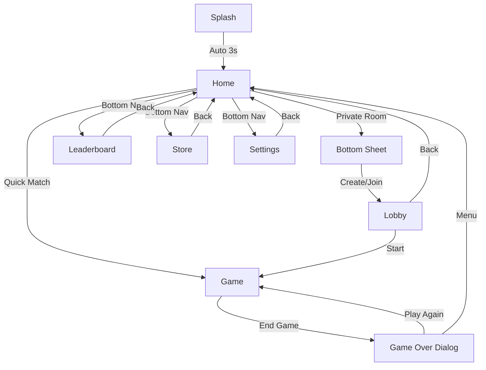

# Navigation Guide - Yes Or No App

## 🗺️ Navigation Structure

This document outlines the complete navigation architecture and implementation details for the Yes Or No application.

## 📋 Available Routes

All routes are defined in [`lib/core/routes/app_routes.dart`](lib/core/routes/app_routes.dart):

```dart
class AppRoutes {
  static const String splash = '/splash';      // Initial splash screen
  static const String home = '/home';          // Main menu
  static const String lobby = '/lobby';        // Private room lobby
  static const String game = '/game';          // Active game screen
  static const String leaderboard = '/leaderboard';  // Leaderboard
  static const String store = '/store';        // In-app store
  static const String settings = '/settings';  // Settings screen
}
```

## 🔄 Navigation Flow

```
[Splash Screen]
      ↓ (3 seconds auto-navigate)
[Home Screen]
      ↓
   ┌──┴──┐
   │     │
[Quick] [Private]
Match   Room
   │     │
   │   [Lobby]
   │     │
   └──┬──┘
      ↓
[Game Room]
      ↓
[Game Over Dialog]
      ↓
   ┌──┴──┐
   │     │
[Play] [Back to]
Again   Menu
```

## 📱 Screen Navigation Details

### 1. Splash Screen
**Route**: `AppRoutes.splash`  
**Auto-navigation**: After 3 seconds → Home Screen  
**Implementation**:
```dart
Timer(const Duration(seconds: 3), () {
  if (mounted) {
    Navigator.of(context).pushReplacementNamed(AppRoutes.home);
  }
});
```

### 2. Home Screen
**Route**: `AppRoutes.home`  
**Navigation Options**:
- **Quick Match** → Game Room
- **Private Room** → Show bottom sheet → Lobby
- **Bottom Nav**: Leaderboard, Store, Settings

**Implementation**:
```dart
// Quick Match
void _onQuickMatch() {
  Navigator.of(context).pushNamed(AppRoutes.game);
}

// Private Room
void _onPrivateRoom() {
  showModalBottomSheet(
    context: context,
    builder: (context) => PrivateRoomBottomSheet(),
  );
}

// Bottom Navigation
void _onBottomNavTap(int index) {
  switch (index) {
    case 0: Navigator.of(context).pushNamed(AppRoutes.leaderboard);
    case 1: // Already on home
    case 2: Navigator.of(context).pushNamed(AppRoutes.store);
    case 3: Navigator.of(context).pushNamed(AppRoutes.settings);
  }
}
```

### 3. Private Room Bottom Sheet
**Triggers**:
- **Create Room** → Lobby Screen
- **Join Room** → Lobby Screen (with room code)

**Implementation**:
```dart
// Create Room
CustomButton(
  onPressed: () {
    Navigator.of(context).pop(); // Close bottom sheet
    Navigator.of(context).pushNamed(AppRoutes.lobby);
  },
  child: Text('Create Room'),
)

// Join Room
CustomButton(
  onPressed: () {
    Navigator.of(context).pop(); // Close bottom sheet
    Navigator.of(context).pushNamed(AppRoutes.lobby);
  },
  child: Text('Join Room'),
)
```

### 4. Lobby Screen
**Route**: `AppRoutes.lobby`  
**Parameters**: Optional `roomCode` (String)  
**Navigation**:
- **Back Button** → Pop to previous screen
- **Start Game** (disabled in prototype) → Would navigate to Game

**Implementation**:
```dart
// AppBar back button (automatic)
appBar: AppBar(
  leading: IconButton(
    icon: const Icon(Icons.arrow_back),
    onPressed: () => Navigator.of(context).pop(),
  ),
)

// Route with parameters
Navigator.of(context).pushNamed(
  AppRoutes.lobby,
  arguments: roomCode, // Optional
);
```

### 5. Game Room Screen
**Route**: `AppRoutes.game`  
**Navigation**:
- **System Back Button** → Shows confirmation dialog
- **Make Final Guess** → Shows Game Over Dialog

**Back Button Protection**:
```dart
PopScope(
  canPop: false,
  onPopInvoked: (bool didPop) async {
    if (didPop) return;
    
    final shouldPop = await showDialog<bool>(
      context: context,
      builder: (context) => ConfirmationDialog(),
    );
    
    if (shouldPop == true && context.mounted) {
      Navigator.of(context).pop();
    }
  },
  child: GameScreen(),
)
```

### 6. Game Over Dialog
**Trigger**: End of game (win/loss)  
**Navigation Options**:
- **Play Again** → Restart game (replace current screen)
- **Back to Menu** → Return to home (clear stack)

**Implementation**:
```dart
// Play Again
CustomButton(
  onPressed: () {
    Navigator.of(context).pop(); // Close dialog
    Navigator.of(context).pushReplacementNamed(AppRoutes.game);
  },
  child: Text('Play Again'),
)

// Back to Menu
CustomButton(
  onPressed: () {
    Navigator.of(context).pushNamedAndRemoveUntil(
      AppRoutes.home,
      (route) => false, // Clear entire stack
    );
  },
  child: Text('Back to Menu'),
)
```

### 7. Placeholder Screens
**Routes**: `AppRoutes.leaderboard`, `AppRoutes.store`, `AppRoutes.settings`  
**Navigation**: All have AppBar with automatic back button

## 🛠️ Navigation Methods

### Standard Navigation
```dart
// Push new route
Navigator.of(context).pushNamed(AppRoutes.routeName);

// Push with arguments
Navigator.of(context).pushNamed(
  AppRoutes.routeName,
  arguments: yourArguments,
);

// Pop current route
Navigator.of(context).pop();

// Pop with result
Navigator.of(context).pop(resultData);
```

### Advanced Navigation
```dart
// Replace current route
Navigator.of(context).pushReplacementNamed(AppRoutes.routeName);

// Clear stack and navigate
Navigator.of(context).pushNamedAndRemoveUntil(
  AppRoutes.home,
  (route) => false, // Removes all routes
);

// Pop until specific route
Navigator.of(context).popUntil(
  (route) => route.settings.name == AppRoutes.home,
);

// Pop to first route
Navigator.of(context).popUntil((route) => route.isFirst);
```

### Using Navigation Service (Optional)
```dart
import '../core/di/service_locator.dart';

final nav = serviceLocator.navigationService;

// Navigate
nav.navigateTo(AppRoutes.game);

// Navigate and replace
nav.navigateAndReplace(AppRoutes.home);

// Navigate and clear stack
nav.navigateAndRemoveAll(AppRoutes.home);

// Go back
nav.goBack();

// Check if can go back
if (nav.canGoBack()) {
  nav.goBack();
}
```

## 🚨 Common Navigation Patterns

### 1. Preventing Accidental Exits
Use `PopScope` to intercept back button:
```dart
PopScope(
  canPop: false,
  onPopInvoked: (bool didPop) async {
    if (didPop) return;
    
    final confirm = await showConfirmDialog(context);
    if (confirm && context.mounted) {
      Navigator.of(context).pop();
    }
  },
  child: YourScreen(),
)
```

### 2. Modal Bottom Sheets
```dart
showModalBottomSheet(
  context: context,
  isScrollControlled: true,
  backgroundColor: Colors.transparent,
  builder: (context) => YourBottomSheet(),
);

// Close bottom sheet
Navigator.of(context).pop();
```

### 3. Dialogs
```dart
// Show dialog
final result = await showDialog<bool>(
  context: context,
  barrierDismissible: false, // Prevent dismiss on outside tap
  builder: (context) => YourDialog(),
);

// Close dialog
Navigator.of(context).pop(result);
```

### 4. Passing Data Between Screens
```dart
// Send data
Navigator.of(context).pushNamed(
  AppRoutes.lobby,
  arguments: {'roomCode': 'ABC123'},
);

// Receive data
class LobbyScreen extends StatefulWidget {
  @override
  Widget build(BuildContext context) {
    final args = ModalRoute.of(context)?.settings.arguments as Map?;
    final roomCode = args?['roomCode'] as String?;
    // Use roomCode...
  }
}
```

### 5. Returning Data from Screen
```dart
// Screen A - Navigate and wait for result
final result = await Navigator.of(context).pushNamed(AppRoutes.settings);
if (result != null) {
  // Handle returned data
}

// Screen B - Return data
Navigator.of(context).pop({'settingsSaved': true});
```

## 🎯 Best Practices

### 1. Always Use Route Constants
```dart
// ❌ BAD - Hardcoded strings
Navigator.of(context).pushNamed('/game');

// ✅ GOOD - Use constants
Navigator.of(context).pushNamed(AppRoutes.game);
```

### 2. Check Context Validity
```dart
// ❌ BAD - May cause errors if widget unmounted
Navigator.of(context).pop();

// ✅ GOOD - Check if mounted
if (context.mounted) {
  Navigator.of(context).pop();
}
```

### 3. Clean Up Navigation Stack
```dart
// ❌ BAD - Leaves screens in stack
Navigator.of(context).pushNamed(AppRoutes.home);
Navigator.of(context).pushNamed(AppRoutes.home);
Navigator.of(context).pushNamed(AppRoutes.home);

// ✅ GOOD - Clear stack when returning to home
Navigator.of(context).pushNamedAndRemoveUntil(
  AppRoutes.home,
  (route) => false,
);
```

### 4. Handle Async Navigation
```dart
// ❌ BAD - Fire and forget
void goToGame() {
  Navigator.of(context).pushNamed(AppRoutes.game);
}

// ✅ GOOD - Await and handle
Future<void> goToGame() async {
  await Navigator.of(context).pushNamed(AppRoutes.game);
  // Screen was popped, handle cleanup if needed
}
```

### 5. Protect Critical Screens
```dart
// For game screens, payment screens, etc.
PopScope(
  canPop: false,
  onPopInvoked: (didPop) async {
    // Show confirmation or save data
  },
  child: CriticalScreen(),
)
```

## 🐛 Troubleshooting

### Error: "No route defined for..."
**Cause**: Route not registered in `RouteGenerator.generateRoute`  
**Fix**: Add route case in [`lib/core/routes/route_generator.dart`](lib/core/routes/route_generator.dart)

### Error: "Navigator operation requested with a context..."
**Cause**: Using context after widget is unmounted  
**Fix**: Check `if (context.mounted)` before navigation

### Back Button Not Working
**Cause**: Using `PopScope` with `canPop: false`  
**Fix**: Ensure you call `Navigator.pop()` in `onPopInvoked` callback

### Dialog Not Closing
**Cause**: Not calling `Navigator.pop()` in dialog buttons  
**Fix**: Add `Navigator.of(context).pop()` to all dialog action buttons

## 📚 Related Files

- [`lib/core/routes/app_routes.dart`](lib/core/routes/app_routes.dart) - Route constants
- [`lib/core/routes/route_generator.dart`](lib/core/routes/route_generator.dart) - Route generation logic
- [`lib/services/navigation_service.dart`](lib/services/navigation_service.dart) - Navigation service (optional)
- [`lib/main.dart`](lib/main.dart) - App initialization with navigator key

## 🔗 Navigation Graph



---

**Last Updated**: 2025-10-20  
**Author**: Semih Aşdan (semih.asdan@gmail.com)
