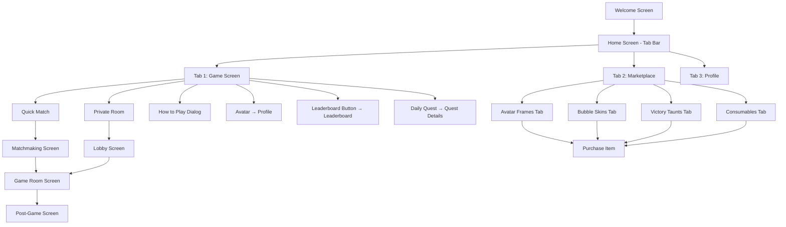

# Navigation Structure Update

## New Navigation Flow

### Bottom Navigation Bar (3 Tabs)

```
┌──────────────────────────────────────────┐
│                                          │
│              [SCREEN CONTENT]            │
│                                          │
│                                          │
└──────────────────────────────────────────┘
     🎮          🏪          👤
   GAME      MARKETPLACE   PROFILE
  (Home)      (Store)    (Account)
```

### Tab Descriptions

#### Tab 1: Game (Home) 🎮
**Initial Tab** - Opens to Game Screen
- **Header**:
  - User avatar with frame (left)
  - Yes/No logo (center)
  - Coin balance + Leaderboard button (right)
- **Content**:
  - Quick Match button
  - "How to Play" link
  - Private Room button
  - Daily Quest widget

#### Tab 2: Marketplace 🏪
**New Feature** - Shopping experience
- **Content**:
  - 4 category tabs:
    - Avatar Frames
    - Bubble Skins
    - Victory Taunts
    - Consumables (Hints)
  - Grid layout of purchasable items
  - Coin prices displayed
  - "Owned" indicator for purchased items

#### Tab 3: Profile 👤
**Existing** - User information
- User profile display
- Statistics
- Settings

---

## Navigation Changes Summary

### Before
```
┌─────────────────────────────────┐
│   🏆      🎮      👤           │
│  BOARD   GAME   PROFILE         │
└─────────────────────────────────┘
```

### After
```
┌─────────────────────────────────┐
│   🎮      🏪      👤           │
│   GAME   STORE   PROFILE        │
└─────────────────────────────────┘
```

### Key Changes:
1. ❌ **Removed**: Leaderboard from bottom nav
2. ✅ **Added**: Marketplace to bottom nav
3. ✅ **Moved**: Leaderboard button to Game screen header
4. ✅ **Changed**: Default tab from Game (index 1) to Game (index 0)

---

## Header Navigation (Game Screen)

```
┌──────────────────────────────────────┐
│  👤 Avatar    🎯 Logo    💰150  🏆 │
│    (Profile)           (Coins) (LB) │
└──────────────────────────────────────┘
     ↓                              ↓
  Profile Screen            Leaderboard Screen
```

### Header Actions:
- **Avatar (Left)**: Tap to open Profile
- **Logo (Center)**: Non-interactive (branding)
- **Coins (Right)**: Display only (future: tap to marketplace)
- **Leaderboard Icon (Right)**: Tap to open Leaderboard

---

## Complete Navigation Map



---

## Screen Hierarchy

### Level 1: Tab Bar (Persistent)
- Game Screen
- Marketplace Screen
- Profile Screen

### Level 2: Game Screen Routes
- Matchmaking Screen
- Lobby Screen
- Leaderboard Screen (via header button)
- Profile Screen (via header avatar)
- How to Play Dialog (modal)

### Level 3: Gameplay
- Game Room Screen
- Post-Game Screen

### Level 2: Marketplace Routes
- Purchase Confirmation (modal)
- Preview (future feature)

### Level 2: Profile Routes
- Settings
- Edit Profile
- Achievement Details

---

## User Journey Examples

### Journey 1: Quick Match
```
Welcome → Game Tab → Quick Match → Matchmaking → Game Room → Post-Game
```

### Journey 2: Purchase Cosmetic
```
Welcome → Game Tab → View Coins → Marketplace Tab → Avatar Frames → Purchase → Equip → Back to Game (see equipped frame)
```

### Journey 3: Daily Quest
```
Welcome → Game Tab → See Quest → Quick Match → Win Duel → Return → See Progress → Complete → Earn Coins
```

### Journey 4: View Leaderboard
```
Welcome → Game Tab → Tap Leaderboard Icon → View Rankings → Back
```

### Journey 5: New Player Onboarding
```
Welcome → Game Tab → See "How to Play" → Read Guide → Tap Quick Match
```

---

## Gesture Navigation

### Tap Gestures
- Avatar (header) → Profile
- Leaderboard icon → Leaderboard
- Quick Match button → Matchmaking
- Private Room button → Room modal
- "How to Play" link → Tutorial dialog
- Daily Quest card → Quest details (future)
- Marketplace item → Purchase modal
- Bottom nav tabs → Switch screens

### Swipe Gestures
- Swipe left/right on tab content → Switch tabs
- Swipe down on modals → Dismiss

### Long Press (Future)
- Avatar → Quick actions menu
- Marketplace item → Preview

---

## Back Button Behavior

### Android/Browser Back Button

| Current Screen | Back Action |
|----------------|-------------|
| Game Tab | Exit app confirmation |
| Marketplace Tab | Go to Game Tab |
| Profile Tab | Go to Game Tab |
| Matchmaking | Go to Game Tab |
| Lobby | Go to Game Tab |
| Game Room | Exit game confirmation |
| Leaderboard | Go to Game Tab |
| How to Play Dialog | Dismiss dialog |
| Purchase Modal | Dismiss modal |

---

## Deep Link Support (Future)

Recommended deep link structure:

```
yesorno://home              → Game Tab
yesorno://marketplace       → Marketplace Tab
yesorno://marketplace/frames → Frames category
yesorno://profile           → Profile Tab
yesorno://leaderboard       → Leaderboard Screen
yesorno://play              → Quick Match
yesorno://room/:code        → Join Private Room
```

---

## Navigation State Management

### Tab State Persistence
- **Current Implementation**: Index stored in `_selectedIndex`
- **Recommendation**: Save last tab in shared preferences
- **Default**: Always start on Game Tab (index 0)

### Screen State Preservation
- PageView maintains state when switching tabs
- Each tab keeps its scroll position
- Form inputs preserved during navigation

### Navigation Stack
```
[Welcome] → [TabBar Container]
              ↓
         [PageView with 3 screens]
           ↓         ↓         ↓
        [Game]  [Market]  [Profile]
           ↓
    [Pushed Routes...]
```

---

## Accessibility

### Screen Reader Announcements
- Tab changes: "Switched to [Tab Name] tab"
- Modal opens: "[Modal Name] dialog opened"
- Purchase: "Item purchased successfully"

### Focus Management
- Tab switch → Focus first interactive element
- Modal open → Focus modal title
- Modal close → Return focus to trigger element

### Keyboard Navigation (Web/Desktop)
- Tab key: Cycle through interactive elements
- Arrow keys: Switch bottom nav tabs
- Enter/Space: Activate buttons
- Esc: Close modals/dialogs

---

## Performance Considerations

### Tab Loading
- All tabs pre-loaded in PageView (instant switching)
- Trade-off: Slight increase in memory usage
- Benefit: Smooth, lag-free tab transitions

### Route Transitions
- Material page transitions (300ms default)
- No custom animations to keep it snappy
- Future: Add hero animations for items

### State Management
- Provider for user profile (single source of truth)
- Local state for UI interactions
- Debouncing for expensive operations

---

This navigation structure prioritizes:
1. **Discovery**: Marketplace is easily accessible
2. **Engagement**: Game tab is default for quick action
3. **Clarity**: Clear visual hierarchy and CTAs
4. **Efficiency**: Minimal taps to core actions
