# Quick Start Authentication - Flow Diagrams

## 🎯 Visual Process Flows

This document provides visual representations of the Quick Start authentication flow.

---

## 1. Overall System Flow

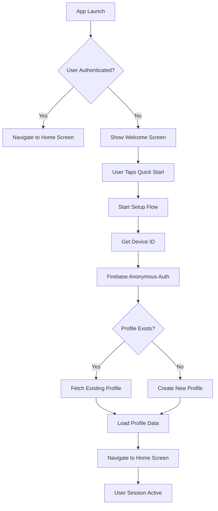

---

## 2. Quick Start Button Logic (Detailed)

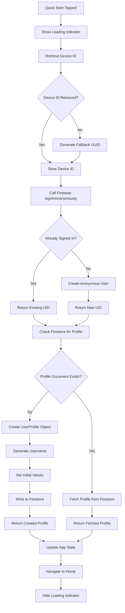

---

## 3. Error Handling Flow

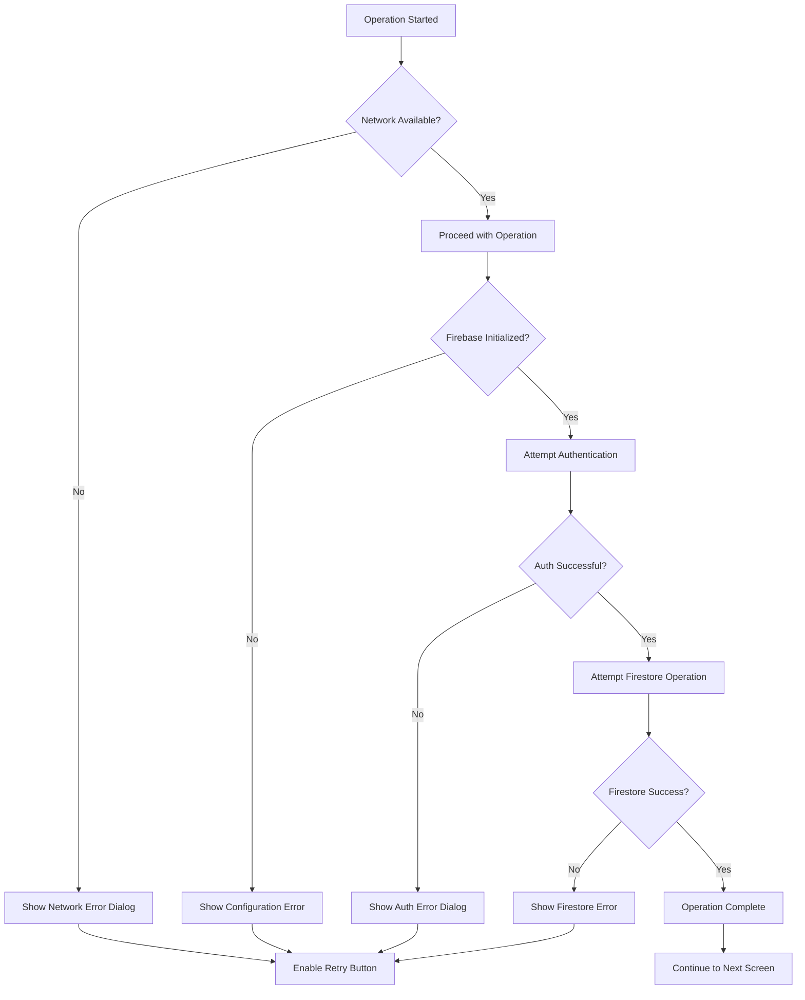

---

## 4. Data Flow Architecture

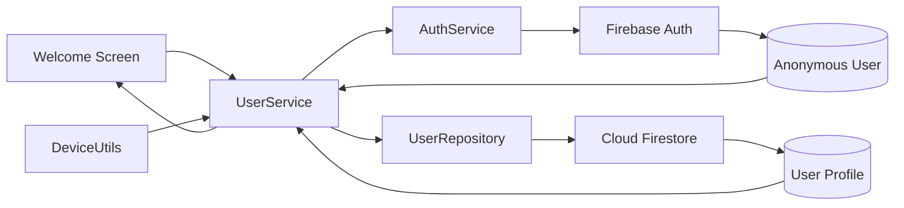

---

## 5. First-Time User Sequence

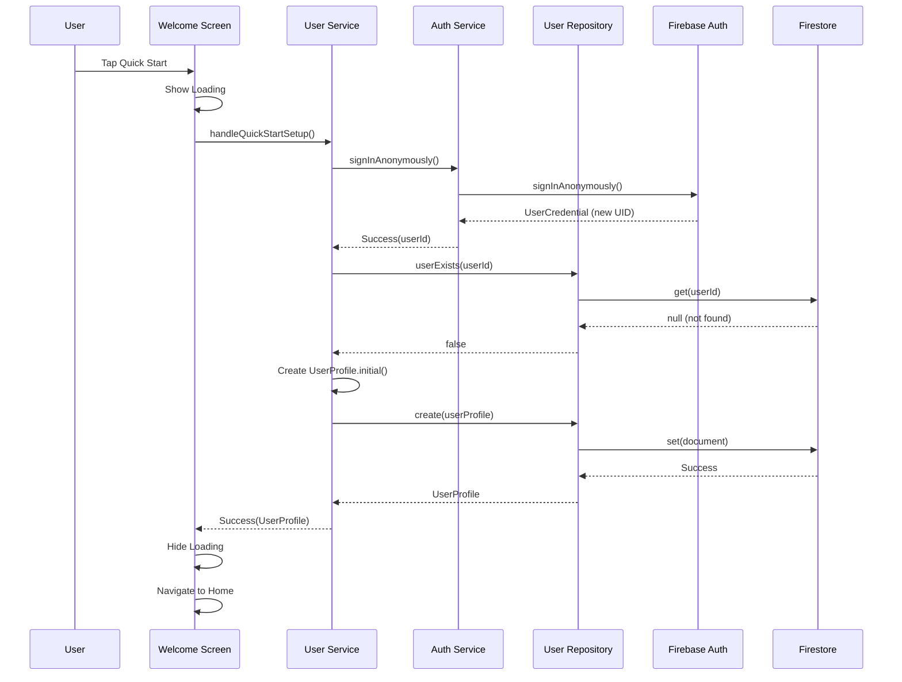

---

## 6. Returning User Sequence

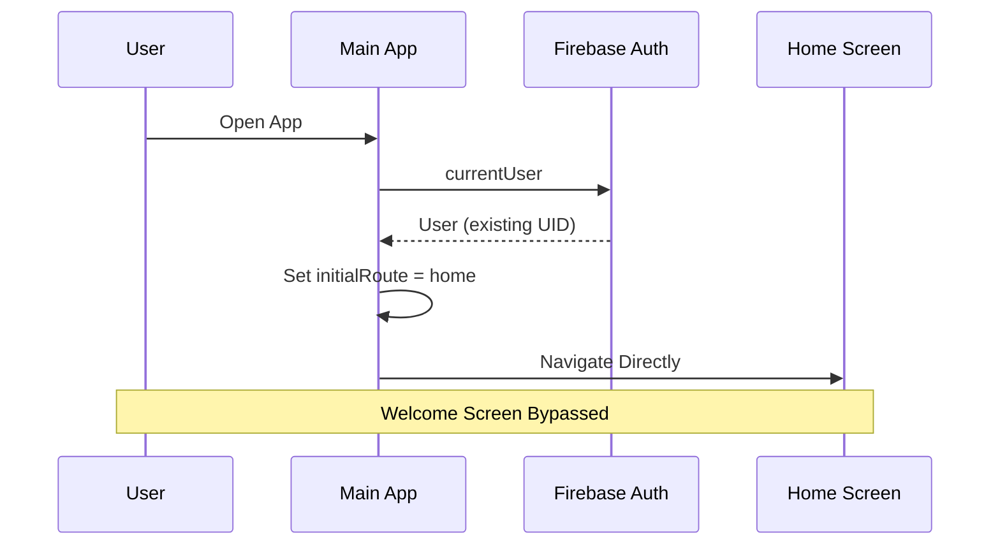

---

## 7. State Management Flow

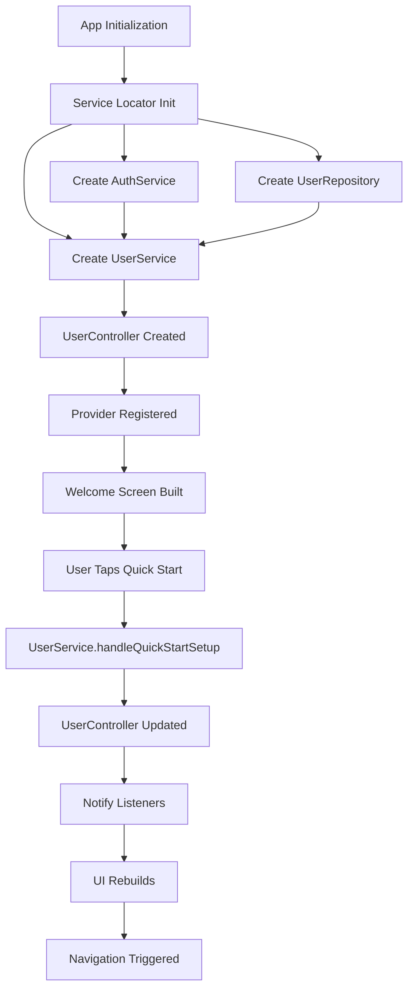

---

## 8. Profile Creation Data Structure

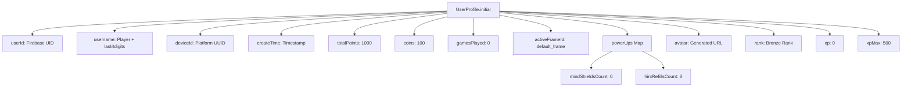

---

## 9. Device ID Platform Strategy

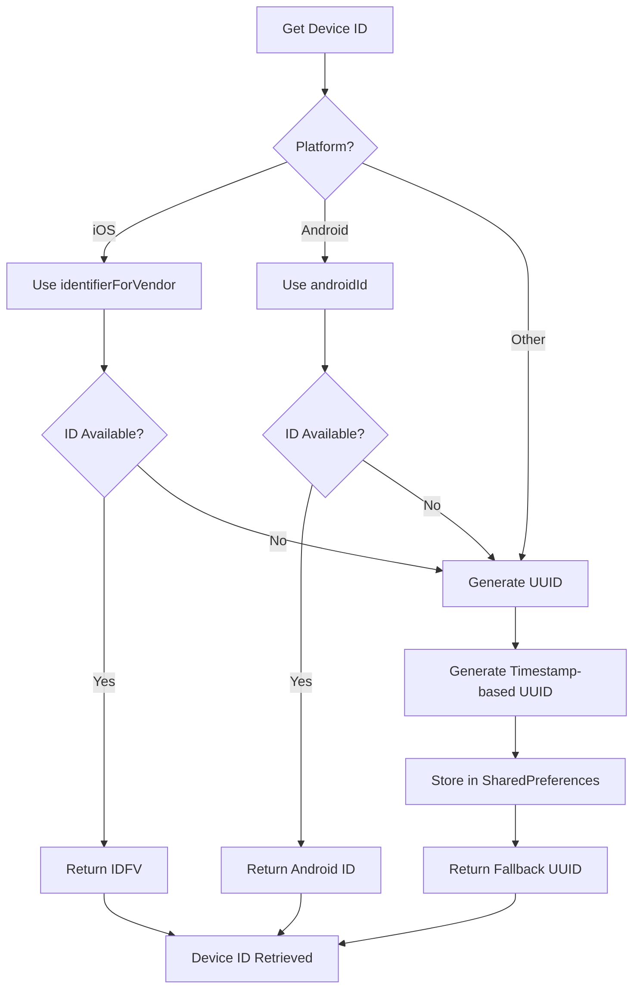

---

## 10. Security & Permissions Flow

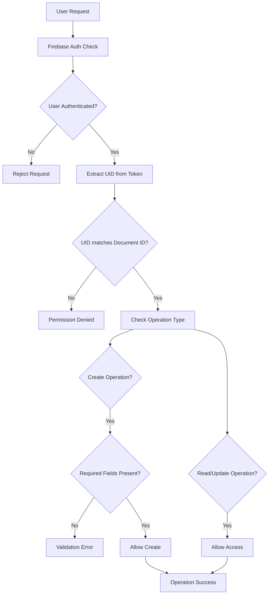

---

## 11. Retry & Resilience Strategy

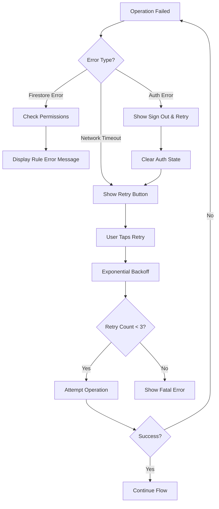

---

## 12. Complete Implementation Layers

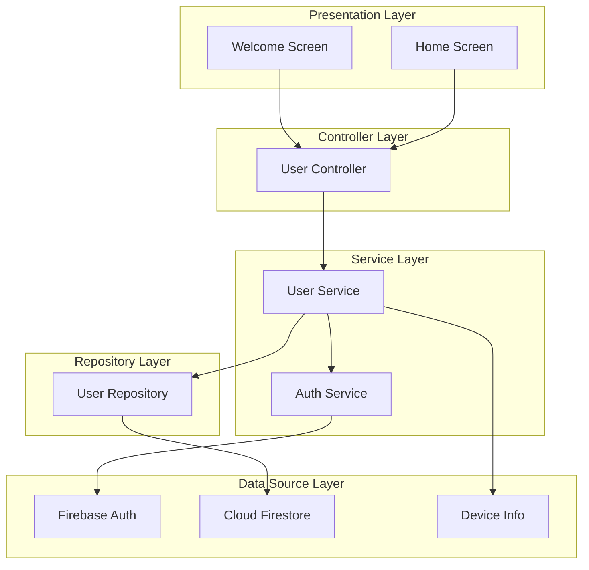

---

## 13. Loading & UI States

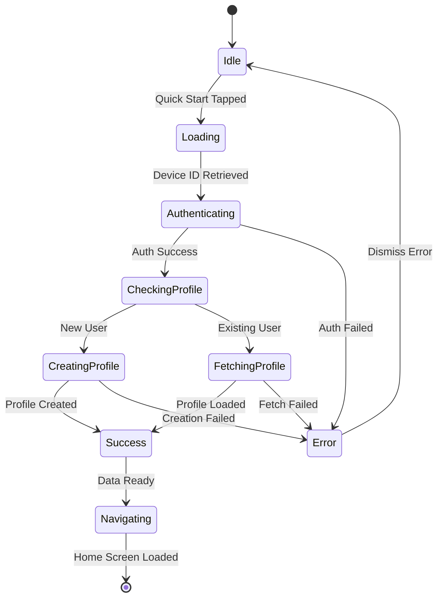

---

## 14. Testing Flow

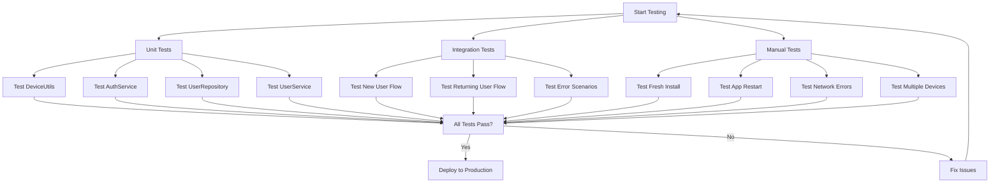

---

## 15. Firebase Console Setup Steps

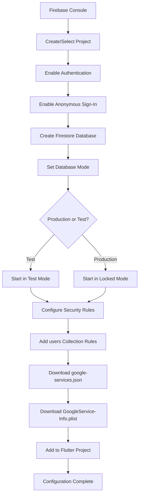

---

## Key Takeaways

### Critical Success Factors
1. ✅ **Firebase Initialization First**: Must be called before any Firebase operation
2. ✅ **Check Existing Auth**: Always check `currentUser` before creating new session
3. ✅ **Unique Profile Check**: Verify profile doesn't exist before creation
4. ✅ **Error Handling**: Gracefully handle network, auth, and Firestore errors
5. ✅ **Loading States**: Provide visual feedback during async operations
6. ✅ **Session Persistence**: Firebase Auth handles this automatically
7. ✅ **Security Rules**: Essential to prevent unauthorized access

### Common Pitfalls to Avoid
- ❌ Not initializing Firebase before operations
- ❌ Creating duplicate profiles for same user
- ❌ Missing error handling for network issues
- ❌ Not showing loading indicators
- ❌ Forgetting to configure Firestore security rules
- ❌ Not handling returning user scenario

---

**Document Version:** 1.0  
**Created:** 2025-10-21  
**Purpose:** Visual reference for Quick Start authentication implementation
